## Documentation for Project 10
## LOAD BALANCER SOLUTION WITH NGINX AND SSL/TLS
## TOOLING WEBSITE DEPLOYMENT AUTOMATION WITH CONTINUOUS INTEGRATION; INTRODUCTION TO JENKINS CI CAPABILITIES.
## The 3-Tier Web Application Architecture with single database, NFS Server as a shared files storage + Load Blanacer - Apache, (Including the numbers of Web servers =2).

## STEP 1 — Install and CONFIGURE NGINX AS A LOAD BALANCER

-- This is a sequel to Project 7. (2 - Web Server - as client Server, 1 - DB Server -To serve as client Request, 1 - NFS Web Server - Used as shared files Storage, 1 Nginx server (Instead of Apache Server)- Acting as the load balancer) labelled "P10 Nginx-LB. Also spinning up an Ubuntu 20.04 Linux server for Nginx Load Balance Server in aws EC2.

`sudo apt update -y`; `sudo apt upgrade -y`--(Updating and upgrading Web server aws ec2 ubuntu 20.04 Linux terminal with ubuntu packages using ubuntu package manager 'apt')
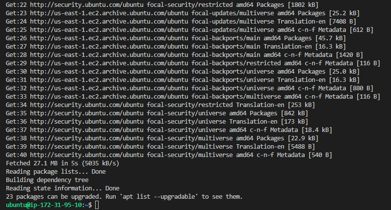

`sudo vi /etc/hosts`--(Updating directory /etc/hosts file for my local DNS with Web Servers’ names (Web1 and Web2) and their local IP addresses)
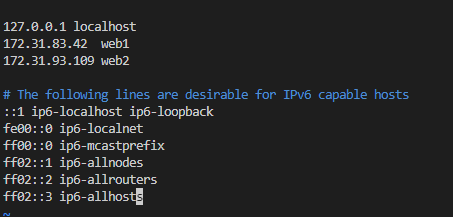

`sudo apt install nginx -y`--(Running command to install Nginx software)
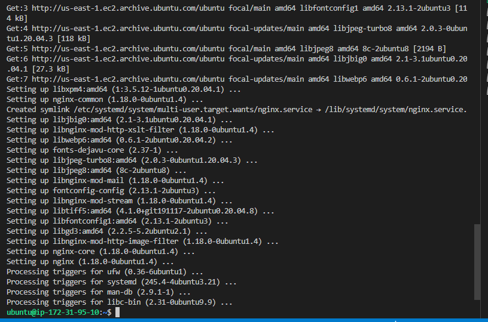

`sudo vi /etc/nginx/nginx.conf`--(Using vi text editor to insert block code to my virtual host configuration file in nginx 1.to this making reference to both my web server 'web1 and web2' in my /etc/hosts directory and thier private IP addresses. 2. we comment out line --'include /etc/nginx/sites-enabled/*;')
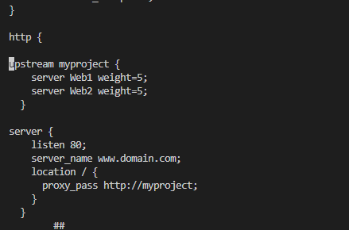 
(./Image10/Ngnix-InsertBlockCode-NginxConf-4a.PNG)

`sudo systemctl restart nginx`; `sudo systemctl status nginx`--(Ensure that nginx server is up and Running)
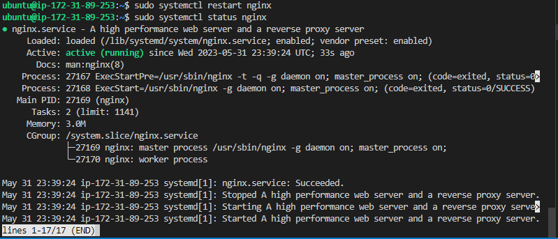

## STEP 2

--(1- Register a new domain name 'eama.live' with domain name registrar 'Godaddy.com' having domain zone of '.live'.  2 - Updating my DNS record 'eama.live' in my registrar with the Public 'Dynamic' IP address/ Elastic 'Static' IP adddress to point to Nginx Load balancer server)
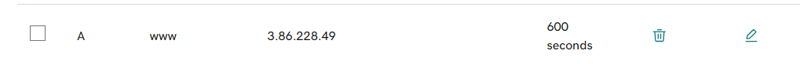

`sudo vi /etc/nginx/nginx.conf` ; `server_name www.<your-domain-name.com>` to `server_name www.eama.live` --(In Nginx configuration file, Configure Nginx LB to recognize my domain name 'eama.live' by amending server_name )
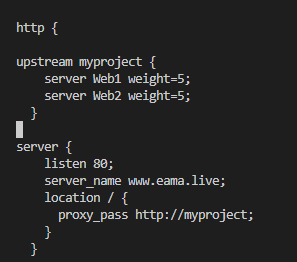

`www.eama.live`--(Insert my domain name 'www.eama.live' in the brower after amending and updating my nginx configuration file for the server name command line)
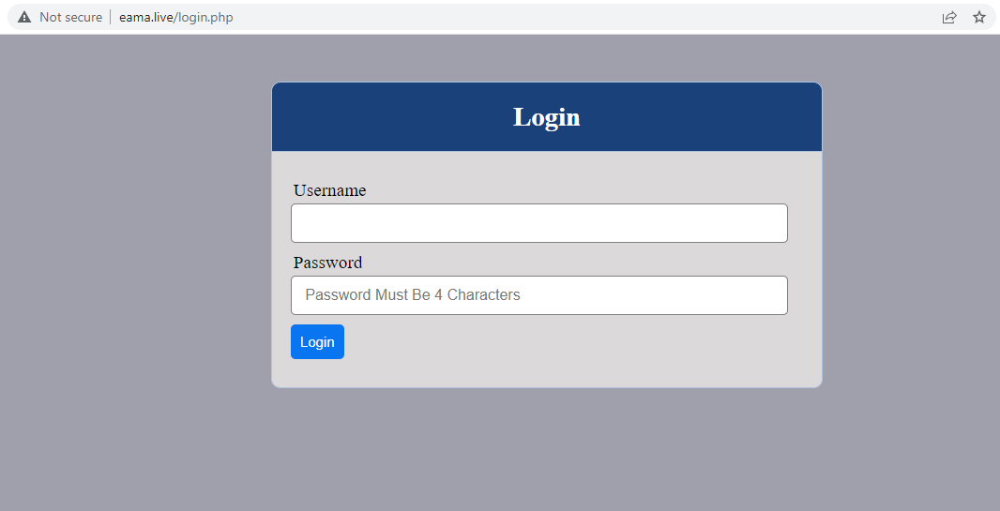

`snap list` or `sudo systemctl status snapd`--( Running command to ensure snapd service is active and running, then I can Install certbot, Snap is pre-installed and ready to go on all recent releases of Ubuntu from 14.04 and above)
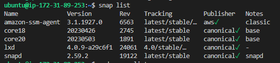

`sudo snap install --classic certbot`; `sudo ln -s /snap/bin/certbot /usr/bin/certbot`;
`sudo certbot --nginx`--(Running command to Install certbot and request for an SSL/TLS certificate, following certbot instructions then choosing my domain name to which certificate should be issued for, domain name will be looked up from nginx.conf file)
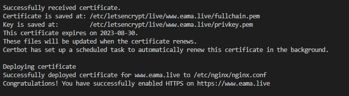

`https://www.eama.live`--(Testing secured access to your Web Solution by trying to reach 'https', Tooling website is deployed over a more secure network protocol that use TCP port 443 through the internet. We can view pictogram in my browser’s search string - the lock validating secure site)
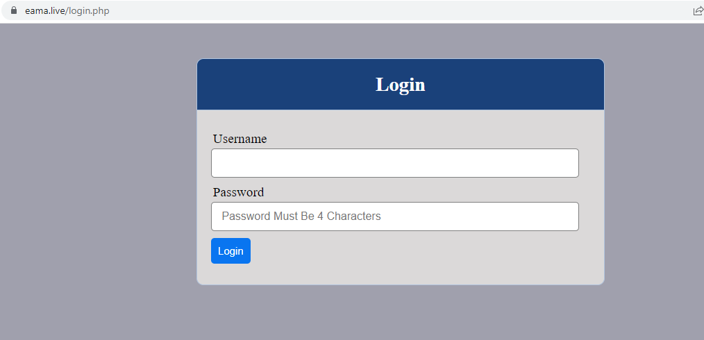

--(We can view pictogram in my browser’s search string - the lock validating secure site,Click on the padlock icon ato see the details of the certificate issued for my website.)
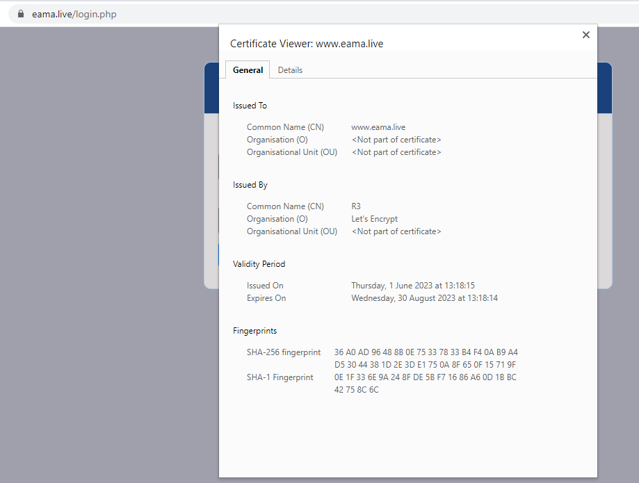

`sudo certbot renew --dry-run`--(Testing renewal command in dry-run mode)
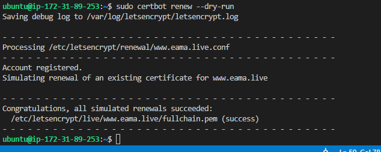

`crontab -e`; `* */12 * * *   root /usr/bin/certbot renew > /dev/null 2>&1`--(Best pracice is to have a scheduled job that to run renew command periodically. now configuring a cronjob to run the command twice a day.)
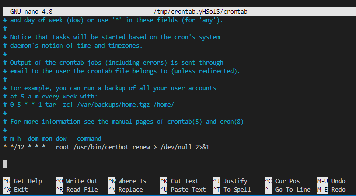
